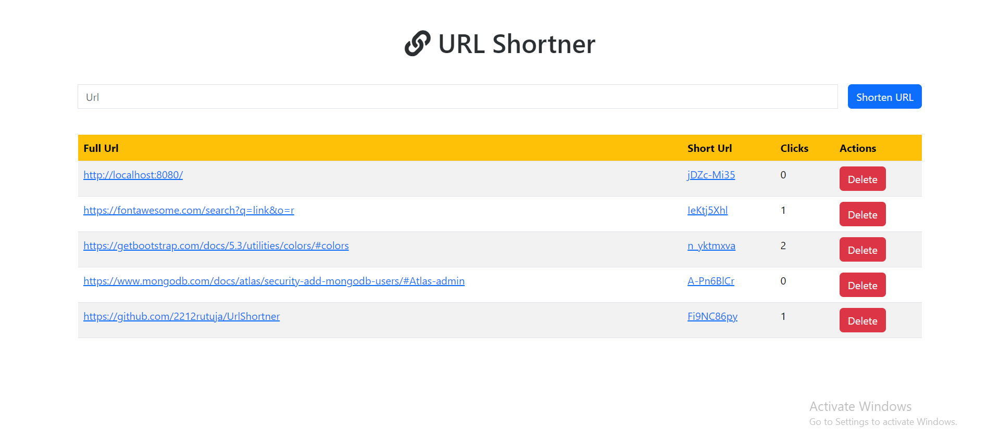

# URL Shortener

A simple URL shortener project built with Ejs, Node.js, Express, and MongoDB.




## Table of Contents
- [Description](#description)
- [Installation](#installation)
- [Usage](#usage)


## Description

URL Shortener is a web application that allows users to shorten long URLs, making them easier to share. This project is built using Node.js for the backend, Express for the web server, and MongoDB for storing URL data. and Ejs for UI

## Installation

1. Clone the repository:

   ```bash
   git clone https://github.com/2212rutuja/UrlShortner.git

2. Navigate to the project directory:

cd UrlShortner

3. Create a .env file in the project root with the following content:


USERNAME=your_mongodb_username
PASSWORD=your_mongodb_password

4. npm start

Usage
Access the application in your web browser.

Enter a full URL in the provided input field.

Click the "Shorten" button to generate a shortened URL.

Copy and share the shortened URL.
   
